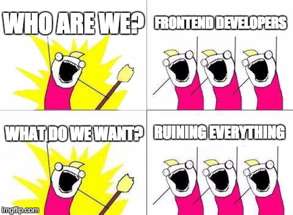
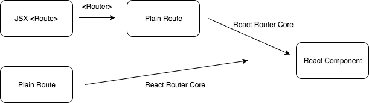

江湖傳說：

> 前端半月一小改，三月一大改

舉凡編程風格、系統架構、框架，乃至使用工具，時時有新玩意兒。作為一個前端工程師，為求不要成為 **邊緣人** ，又不想 **毀了** 無數杯咖啡所堆起的碉堡，誠惶誠恐地追蹤專案中使用套件的最新消息是十分合理的。


What Do We Want

[Viscovery](http://www.viscovery.com) 的前端團隊近期將專案中[React Router v2](https://github.com/ReactTraining/react-router/tree/v2.8.1/docs) 升級至最新的[React Router v4](https://reacttraining.com/react-router/)。本篇文章整理此經驗，以及更多兩個版本的不同。

文章含有一下幾個部分：

*   歷史
*   React Router v4 與以往有何不同
*   需要注意什麼
*   總結

### 歷史

在React Router v4 的文件中有個段落在談[過去的版本與v4 有何不同](https://reacttraining.com/react-router/core/guides/philosophy/backstory)。引用其中一段：

> …we were pretty frustrated with the direction we’d taken React Router by v2. We (Michael and Ryan) felt limited by the API, recognized we were reimplementing parts of React (lifecycles, and more), and it just didn’t match the mental model React has given us for composing UI.

> …We ended up with API that wasn’t “outside” of React, an API that composed, or naturally fell into place, with the rest of React. …

v2 開始，團隊自行實作一個抽離React Component 的Api 介面，而這讓路由邏輯難以與UI Component 作複雜的配合。這次的v4，讓 `<Route>`回歸React Component 的型態，留給使用者更多的彈性及空間。

### React Router v4 與以往有何不同

#### Everything is React Component

> 讓 `<Route>`回歸React Component 的型態，留給使用者更多的彈性及空間。

前段的這句話到底是在說什麼？

實際攤開v2、v3 的React Router文件以及原始碼，過往的流程：


Flow Chart in v2, v3

使用者可以選擇要以JSX 或Plain Route（javascript object）的形式寫出Route，若是前者， `<Router>` 會將其轉換為Plain Route；最後統一由Plain Route 的形式經由React Router 調整成真正輸出的React Component。開發者可以把寫出JSX Route 視為React Router 給予的語法糖，因為那並不是最後真正進入React System 的模樣。

而v4 之後的流程圖：


Flow Chart in v4

直接引用 `react-router-dom` 中的 `<Route>` 就已經是最後React Component 的形式，不會再經過轉換。當然仍可以利用 `react-router-config` 的函數將Route Config 轉為 `<Route>` 。（這部分可見後文）

事實上，Route Config 的名稱修改很好地映現這個版本的改正。過往Object 的形式才是Core Function 在轉換為最終形態前， **唯一** 能接受的介面，因此稱為 **Plain** Route。而在這版順序是反轉的，開發者能 **直接** 寫出最終形態，也能先給出**Config** 再經由函數來轉換為最終形態。

對於v4 ， `<Route>` 中的Component 不再經過處理，尤其是不再有React Router 本身的Lifecycle(onEnter、onChange、onLeave）。

#### Injected Props

過去Route Component 會連帶被夾帶幾組固定的Props，是為 **Injected Props** 。v4 在此做了兩項更動：

1.  移除 `children`
2.  新增`match`
3.  `params` 變為在 `match` 之下。

[match](https://reacttraining.com/react-router/core/api/match) 其意涵為該Route 是 **如何** 對應到此刻的location 。其結構如下：

```js
// match
const route = {
  parmas: { id: '1' },
  isExact: true,
  path: '/users/:uid',
  url: '/users/1',
}
```

#### Plain Route(via [react-router-config](https://github.com/ReactTraining/react-router/tree/master/packages/react-router-config))

在v4 以前的版本，開發者可以使用jsx 的形式編寫route 的內容，亦能夠使用javascript object 的形式，文件中這樣的型態被稱為plain route。

```js
// jsx
const routes = (
  <Route path="/" component={App}>
    <Route path="groups" component={Groups} />
    <Route path="users" component={Users} />
  </Route>
)

// plain route
const routes = {
  path: '/',
  component: App,
  childRoutes: \[
    {
      path: 'groups',
      component: Groups,
    },
    {
      path: 'users',
      component: Users,
    },
  \],
}
```

在v4 之後，React Router 並沒有放棄支援這種形態，只是有些使用上的不同，而且改稱Route Config，實質差異例如格式修改：

*   `childRoutes` 替換為 `routes`
*   path 目前尚未支援relative path，意味著在nested routes 中，child routes 仍必須輸入absolute path

另外另一項差異是，不是由 `<Router>` 將jsx route 轉為plain route ，來達到兩種格式通用性，而是另啟一個[react-router-config](https://github.com/ReactTraining/react-router/tree/master/packages/react-router-config) 作為接口，並且沒有違背v4 改版的精神，轉換的方向為plain route（邏輯上應該稱為route config 了）轉至Component。

react-route-config 含兩個api ，`matchRoutes(routes, path)` 、 `renderRoutes(routes)` 。

`matchRoutes` 回傳一個array ，作用是解析plain route 所match 到的項目，在文件中官方以server side 分析routes 來即時生成資料作為 `matchRoutes` 的可能使用情境。

`renderRoutes` 則是負責將Route Config 轉成route component。要特別注意的是，開發者並不能依憑 `renderRoutes`就直接做到與過去plain route 完全一樣的效果。 `renderRoutes`事實上僅僅是一個回傳route component 的HOC（High Order Component）。因此若是一個nested routes ，開發者必須在每一層含有 child routes 的component 以`renderRoutes` child route 處理。直接看code 吧：

```js
import { renderRoutes } from 'react-router-config'

const routes = {
  path: '/',
  component: App,
  routes: \[
    {
      path: '/groups',
      component: Groups,
    },
    {
      path: '/users',
      component: UserSettings,
      routes: \[
        {
          path: '/users/all',
          component: AllUsers,
        },
      \],
    },
  \],
}

const App = ({ routes }) => (
  <div>
    <h1>App</h1>
    {renderRoutes(routes)}
  </div>
)

const Groups = () => (
  <div>
    <h1>Group</h1>
  </div>
)

const UserSettings = ({ routes }) => (
  <div>
    <h1>User Settings</h1>
    {renderRoutes(routes)}
  </div>
)

const AllUsers = () => (
  <div>
    <h1>All Users</h1>
  </div>
)

ReactDOM.render(
  (
    <BrowserRouter>
      {renderRoutes(routes)}
    </BrowserRouter>
  ),
  document.getElementById('root')
)
```


#### Implement `onEnter` , `onChange` , `onLeave` Yourself

誠如 **Back Story** 所言，v4 以降，不再是以React Router 所包裹的介面讓開發者實作router ，因此也不再提供`onEnter` 、 `onChange` 、 `onLeave`這三個react route lifecycle hook。開發者將必須以React Component Lifecycle 的概念重新實作原本React Router 提供的`onEnter` 、 `onChange` 、 `onLeave` 。

`onChange` 與 `onLeave` 是相對容易重新實作的，以 `componentWillReceiveProps` 、`componentWillUnmount` 一對一對應。開發者需要費心的是 `onEnter` ，儘管與 `componentWillMount` 接近，但仍需要在 `componentWillReceiveProps` 也作出對應的行為（另加上些判斷），才能無縫接軌，細節可以參考這則官方repo 的[issue](https://github.com/ReactTraining/react-router/issues/3854) 。

#### <Route>

React Router 最核心的 `<Route>` 介面在v4 的改版也有些許改變。

首先是加入 `exact` 、`strict` 。 `exact` 為 `true` 時，該route 的path matching 必須是完全地配對；而strict 為 `true` ，讓trailing slash 能影響path matching。

注意，若Route.Component 本身是個nested route，請不要在 `<Route>` 中加入 `exact` ，否則除了巢狀的根路由，其他等到花兒謝了也對應不上。

除此之外，React Router v4 也多提供了除了 `component` 外的兩種render method — `render` 、 `children` 。

`component` 是最為泛用的render method，然而這方法存在一個問題，若使用者直接傳進一個匿名函數（官方稱之為inline function），在每次的配對，都會re-mount。若開發者希望避免此狀況，官方建議使用 `render` 、 `children` 。

`render` 讓開發者能夠直接送一個inline function 。根據[原始碼](https://github.com/ReactTraining/react-router/blob/master/packages/react-router/modules/Route.js#L107)，相較於component 會把inline function 送進 `React.createElement` ， `render` 則會直接運行送入的inline function ，以避免重新建立一個React Element。

`children` 是個很有趣的render method，它接受一個return component 的函數，且無論路由是否配對到，`children` 都會被觸發。開發者必須自行在函數的內容，依照 `match` 來掌握要如何render 。

這樣聽起來有點蠢、多此一舉，不過官方文件舉了一個可能的使用情境：

```js
// from [https://reacttraining.com/react-router/web/api/Route/children-func](https://reacttraining.com/react-router/web/api/Route/children-func)

<Route children={({ match, ...rest }) => (
  {/\* Animate will always render, so you can use lifecycles to
   animate its child in and out \*/}
  <Animate>
    {match && <Something {...rest}/>}
  </Animate> )}
/>
```

簡而言之，在傳統的路由配對行為上，沒有配對到的，是完全不render 。然而你可能會需要在此之上包裹必定渲染的component ，來達到需求。

#### <Switch>

當同階層有複數個routes 時，React Router v4 並不會自動依序採用第一個對應到的route ，而是很_質樸_地每一個route 都會mount 。因此要做到過去版本自動對應，必須在 `<Route>` 之外加上 `<Switch>` （更貼近javascript switch Statement）。

```js
// before v4
<Route path="/" component={App}>
  <Route path="groups" component={Groups} />
  <Route path="users" component={Users} />
</Route>

// v4
<Route path="/" component={App}>
  <Switch>
    <Route path="/groups" component={Groups} />
    <Route path="/users" component={Users} />
  </Switch>
</Route>
```

#### No More `<IndexRoute>`

本次的更新，React Router 拿掉了 `<IndexRoute>` 。由於概念上，父層的 `<Route>` 所對應的component 不再是扮演 template 的角色，並且 `path`也不以相對路徑來定義，因此：

```js
// before v4
<Route path="/" component={App}>
  <IndexRoute component={Home}/>
  <Route path="groups" component={Groups}/>
  <Route path="members" component={Members}/>
</Route>

// v4
<Route path="/" component={App}>
  <Switch>
    <Route path="/" component={Home}/>
    <Route path="/groups" component={Groups}/>
    <Route path="/members" component={Members}/>
  </Switch>
</Route>
```

#### Named Component

過去的版本中， `<Route>` 的 `components` 除了可以帶入component 外，也能帶入一個value 為component 的object 。使用的目的是讓Parent Route 對應的component 不只能用 `prop.children` 來決定child component 的render 方式，而能以 `prop[keyName]` 來選取複數個child component，並且分別佈局，提升開發彈性。

然而在v4 之後，React Router 把這原生就能方便達到的介面抽離，因此開發者需要自行實作之。在Viscovery ，我們實作了一個包裝過的 `<Route>` 來實踐，以下是範例碼：

```js
import React from 'react';
import { Route, Switch } from 'react-router-dom';

import TwoPanelLayout from './TwoPanelLayout';

const TwoPaneRoute = ({ left: Left, right: Right, ...rest }) => (
  <Route
    {...rest}
    render={matchProps => (
      <TwoPanelLayout
        left={<Left {...matchProps} />}
        right={<Right {...matchProps} />}
      />
    )}
  />
);

const AppRoute = () => (
  <Switch>
    <TwoPaneRoute
      exact
      path="whereverYouWant"
      left={LeftComponent}
      right={RightComponent}
    />
  </Switch>
)
```

### 需要注意什麼

#### 程式碼分離

將 `<Route>` 徹底視為一個React Component ，很有可能讓開發者的程式碼分離變得不容易。可能會不小心將 **排版**、 **路由**的邏輯混寫在一起，在Route 中引用Component ，反之亦然。尤其是稍微複雜的運用，例如上一個段落的Named Component 的範例，並不是簡易的一個children rendering 。利用HOC 來分別出**排版**、**路由**的Component 是一個很適當的作法。

#### [React Router Redux](https://github.com/ReactTraining/react-router/tree/master/packages/react-router-redux)

目前React Router Redux 是由React Core Team [維護](https://github.com/reactjs/react-router-redux)，不過實際上已經[移轉](https://github.com/reactjs/react-router-redux#were-moving)予[ReactTraining](https://github.com/ReactTraining) ，也就是React Router 的開發團隊。只是穩定版（React Router Redux v4.x）仍是React Core Team 所開發，又這個版本仍支援React Router v2, v3。

在下一版（React Router Redux v5）則會正式移轉，同時不支援React Router v4 以下的版本，屆時React-Redux 架構的專案則將必須升級React Router **（希望到時這篇文章流量會增加）**。

### 總結

此次改版可用 **返璞歸真**概括。專案中不再同時具有兩種介面、Lifecycle ，讓開發者能夠有一致的開發邏輯。此變動除了降低使用門檻，也讓使用者、第三方套件開發者更合理的增添功能。

特別感謝 [Amdis Liu](https://www.linkedin.com/in/amdis-liu-50b66a42)、[dreamcwli](https://tw.linkedin.com/in/dreamcwli) 提供文章所需的資訊、範例碼以及審閱。

#### 參考資料

*   官方文件
*   [React Router v4 Unofficial Migration Guide](https://codeburst.io/react-router-v4-unofficial-migration-guide-5a370b8905a)
