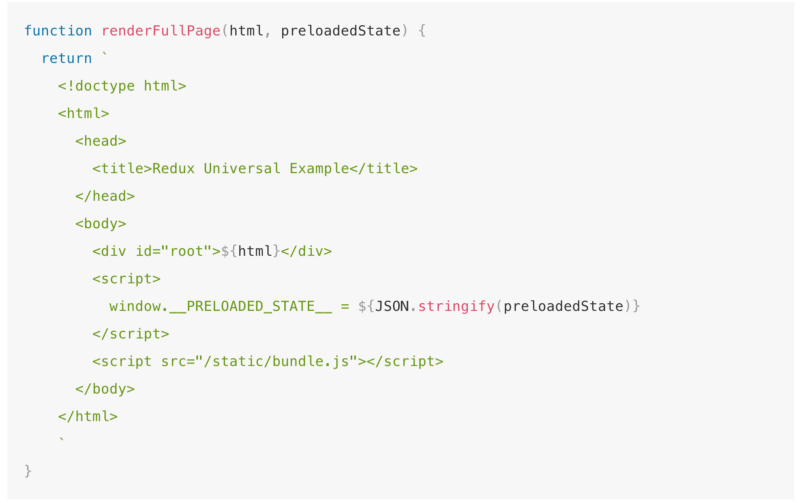

> 本篇為譯文，原文出自https://goo.gl/VFvzs9，作者為[Em Smith](https://medium.com/u/d73cc34e8ee)

多虧了Isomorphic Rendering，讓開發者們很容易收到React的吸引。這裡的Isomorphic Rendering 是指能直接在server-side渲染出你的網頁，並將產生的結果html送到client，此功能可讓client不需要重新渲染整個頁面就能夠達到你期望的互動效果。（譯按：可參考 [**一看就懂的 React Server Rendering（Isomorphic JavaScript）入門教學**](http://blog.techbridge.cc/2016/08/27/react-redux-immutablejs-node-server-isomorphic-tutorial/)）

Redux甚至有如何實作Isomorphic Rendering的[教學文件](http://redux.js.org/docs/recipes/ServerRendering.html)。然而在該頁出現以下這段程式碼：


Redux server-side教學文件中，含有跨站攻擊漏洞的片段

看照這裡後，你可能還在思索，到底標題所提到的安全性漏洞在哪？

別緊張！你不是唯一會這樣想的人。

我在與[Jimmy Jia](https://twitter.com/jimmy_jia)近期的交流中發現到，儘管作為一個有高度經驗的軟體工程師，並且受過一些資安維護的訓練，在我經手開發的網頁應用中，竟意外地含有個 **跨站攻擊漏洞**。

### Em，所以我說，到底出了什麼問題？

本篇想說的的資安漏洞來自於，我們將Redux Store中的狀態傳遞給網頁的過程中。由上面的那張截圖中，我們在script tag裡，僅以`JSON.stringify`將狀態存至一個全域下的變數，以便讓網頁取得狀態。這就是問題所在！

當瀏覽器解析這頁面的html時，會先遇到`<script>`然後繼續往下解析，直到瀏覽器讀到`</script>`。這表示若你的Redux Store中有一個狀態值如底下這段程式碼，砰！你會收到一個`’You have an XSS vulnerability!’` 的警告。

```js
{
  user: {
    username: "NodeSecurity",
    bio: "as</script><script>alert('You have an XSS vulnerability!')</script>"
  }
}
```

瀏覽器並不會如我們預期的，一路讀到上面那張截圖中的`</script>`。取而代之的是，瀏覽器只會讀到狀態中`bio: "as`後頭的`</script>`。

### 你該如何避免這個狀況？

很幸運地 [Open Web Application Security Project](https://www.owasp.org/index.php/About_OWASP) 中精選了一些關於防治跨站攻擊的資源，參考之，我們可以藉由以些增加以下措施來防範這個問題：

1.  我們網頁中所有的輸入介面都必須具備跳脫HTML（HTML escape）的功能。於此，React已經幫你實作了大部分的[HTML跳脫](https://facebook.github.io/react/docs/introducing-jsx.html#jsx-prevents-injection-attacks)。
2.  在Isomorphic Rendering中，當狀態由server送至client時，由於你不會再讓React核心處理那些字串，意即沒人替你實現HTML跳脫。故你需要主動將它們序列化以達到跳脫HTML的目的。

Yahoo工程師以[Serialize JavaScript](https://github.com/yahoo/serialize-javascript) 實作了上述的第二項，基本上你可以直接將他運用於你的應用中。

首先是安裝此module： `npm install --save serialize-javascript`

然後只要以此module的 `serialize`取代上面程式碼裡的`JSON.stringify` 即可。結果參考下圖：


藉由Yahoo的 \`Serialize\` module，我們解決了本來的跨站攻擊漏洞

當資料傳至client時，大致效果如前，但我們做到了HTML跳脫，`</script>`被轉為 `\\u003C\\u002Fscript\\u003E`了！

謹記：儘管你以最現代的技術來建立你的應用，你仍然需要處理一些標準的資安防禦措施。
